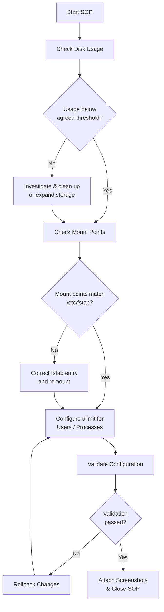
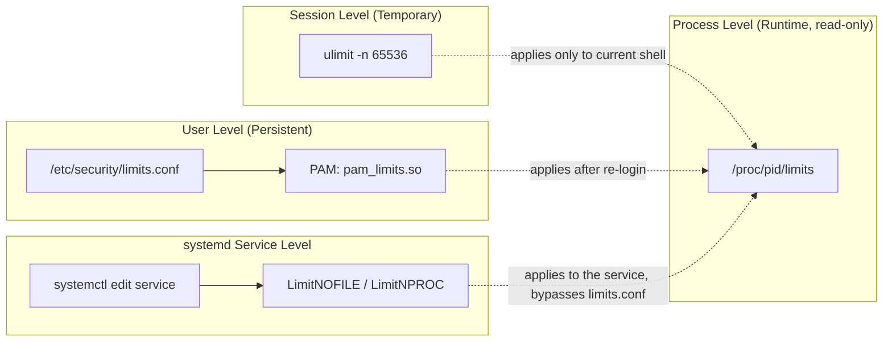

# SOP: Linux | Disk Usage, Mount Points & Ulimit Configuration

---

# Author Table

| **Author** | **Created On** | **Version** | **Last Updated By** | **Last Edited On** | **L0 Reviewer** | **L1 Reviewer** | **L2 Reviewer** |
|---|---|---|---|---|---|---|---|
| Rahul Parihar | 24-08-26 | 1.0 | Rahul Parihar | 25-08-26 | `<Reviewer Name>` | `<Reviewer Name>` | `<Reviewer Name>` |

---

# Table of Contents

1. [Introduction](#1-introduction)
2. [Purpose](#2-purpose)
3. [Prerequisites](#3-prerequisites)
   - [3.1 Access & Permissions](#31-access--permissions)
   - [3.2 System Requirements](#32-system-requirements)
   - [3.3 Tools Used](#33-tools-used)
4. [Roles & Responsibilities](#4-roles--responsibilities)
5. [Procedure Overview](#5-procedure-overview)
6. [Check Disk Usage](#6-check-disk-usage)
7. [Check Mount Points](#7-check-mount-points)
8. [Configure ulimit Settings for Users and Processes](#8-configure-ulimit-settings-for-users-and-processes)
9. [Rollback Procedure](#9-rollback-procedure)
10. [Validation](#10-validation)
11. [Use Cases](#11-use-cases)
12. [Troubleshooting](#12-troubleshooting)
13. [Best Practices](#13-best-practices)
14. [Conclusion](#14-conclusion)
15. [Contact Information](#15-contact-information)
16. [References](#16-references)

---

# 1. Introduction

This SOP provides a structured guide to checking **disk usage**, verifying **mount points**, and configuring **ulimit (resource limit)** settings for users and processes on **Linux (Ubuntu/CentOS/RHEL)** servers.

It covers the required checks, configuration steps, verification, validation, and troubleshooting needed to keep storage and resource limits healthy and consistent across environments.

---

# 2. Purpose

The purpose of this SOP is to provide a standardized procedure for:

- Checking disk space usage across all mounted filesystems and identifying high-usage directories
- Verifying that mount points are active and correctly persisted in `/etc/fstab`
- Reviewing and configuring ulimit values at the session, user, process, and systemd-service level
- Validating that configured limits are effective and rolling back safely if they are not

These procedures help maintain **system stability, reliability, performance, and operational consistency**.

---

# 3. Prerequisites

### 3.1 Access & Permissions

| **Prerequisite** | **Details** |
|---|---|
| SSH Access | SSH access to the target server |
| Privileges | `sudo` / root privileges to view disk, mount, and ulimit configuration files |
| Edit Access | Access to edit `/etc/security/limits.conf` and related systemd unit files, where applicable |

### 3.2 System Requirements

| **Requirement** | **Details** |
|---|---|
| OS & Access | Ubuntu 20.04/22.04 or RHEL/CentOS 7+ with SSH/terminal access |
| Required Packages | `coreutils`, `util-linux`, `procps` (pre-installed on most distros) |
| Permissions | `sudo`/root access where required |
| Configuration | Ability to reload `systemd` and re-login as the target user |

### 3.3 Tools Used

| **Command/File** | **Purpose** |
|---|---|
| `df` | Reports disk space usage of mounted filesystems |
| `du` | Reports disk usage of files/directories |
| `mount` / `findmnt` | Displays currently mounted filesystems |
| `lsblk` | Lists block devices and their mount points |
| `/etc/fstab` | Persistent mount point configuration file |
| `ulimit` | Shell built-in to view/set per-session resource limits |
| `/etc/security/limits.conf` | Persistent per-user/group ulimit configuration |
| `/proc/<pid>/limits` | Shows effective resource limits of a running process |
| `systemd` (`LimitNOFILE=`, etc.) | Resource limit configuration for services managed by systemd |

---

# 4. Roles & Responsibilities

| **Role** | **Responsibility** |
|---|---|
| System Administrator / DevOps Engineer | Executes the checks, applies ulimit configuration, and attaches screenshots as evidence |
| Application Owner | Confirms the resource-limit values required for the application/process |
| Reviewer (L0/L1/L2) | Reviews the completed SOP checklist and evidence before sign-off |

---

# 5. Procedure Overview

The diagram below summarizes the end-to-end flow followed in this SOP — from the initial disk check through to validation and, if needed, rollback.



> [!NOTE]
> Each decision point above maps to a numbered section below: disk usage (Section 6), mount points (Section 7), ulimit configuration (Section 8), rollback (Section 9), and validation (Section 10).

---

# 6. Check Disk Usage

**Quick reference**

| **Step** | **Command** | **Purpose** |
|---|---|---|
| 6.1 | `df -hT` | Overall disk space usage of all mounted filesystems |
| 6.2 | `du -sh /* \| sort -rh \| head -n 15` | Top 15 largest top-level directories |
| 6.3 | `du -sh /path/* \| sort -rh \| head -n 10` | Drill down into a high-usage directory |

## Step 6.1: Check overall disk space usage of all mounted filesystems

```bash
df -hT
```

The `-h` flag prints sizes in human-readable form (K/M/G) and `-T` additionally shows the filesystem type.

Expected output:

```text
Filesystem     Type  Size  Used Avail Use% Mounted on
/dev/sda1      ext4   50G   32G   16G  67% /
/dev/sdb1      xfs   100G   40G   55G  43% /data
```

Confirm no filesystem is above the agreed threshold (commonly 80–90% used).

<details>
<summary>📸 <strong>Screenshot - df -hT output</strong></summary>


</details>

---

## Step 6.2: Identify directories/files consuming the most disk space

```bash
du -sh /* 2>/dev/null | sort -rh | head -n 15
```

This lists the top 15 largest top-level directories, sorted in descending order of size.

<details>
<summary>📸 <strong>Screenshot - du top 15 directories</strong></summary>


</details>

---

## Step 6.3: Drill down into a specific directory (as required)

```bash
du -sh /path/to/directory/* | sort -rh | head -n 10
```

Replace `/path/to/directory` with the directory identified as high-usage in the previous step.

<details>
<summary>📸 <strong>Screenshot - drill-down du output</strong></summary>


</details>

---

# 7. Check Mount Points

**Quick reference**

| **Step** | **Command** | **Purpose** |
|---|---|---|
| 7.1 | `mount \| column -t` | List all currently mounted filesystems |
| 7.2 | `findmnt` | View mount points as a tree/summary |
| 7.3 | `lsblk -f` | Cross-check block devices and mount points |
| 7.4 | `cat /etc/fstab` | Verify persistent mount configuration |

## Step 7.1: List all currently mounted filesystems

```bash
mount | column -t
```

<details>
<summary>📸 <strong>Screenshot - mount output</strong></summary>


</details>

---

## Step 7.2: View mount points in a tree/summary format

```bash
findmnt
```

`findmnt` presents mount points in a hierarchical tree, making parent/child relationships easier to review than the raw `mount` output.

<details>
<summary>📸 <strong>Screenshot - findmnt output</strong></summary>


</details>

---

## Step 7.3: Cross-check block devices and their mount points

```bash
lsblk -f
```

Confirms which physical/virtual disks and partitions map to which mount points and filesystem types.

<details>
<summary>📸 <strong>Screenshot - lsblk -f output</strong></summary>


</details>

---

## Step 7.4: Verify persistent mount configuration

```bash
cat /etc/fstab
```

Confirm that every mount point required to survive a reboot is correctly listed in `/etc/fstab` with the correct device UUID, mount path, filesystem type, and options.

<details>
<summary>📸 <strong>Screenshot - /etc/fstab contents</strong></summary>


</details>

---

# 8. Configure ulimit Settings for Users and Processes

Resource limits exist at four different layers, and it's easy to configure one layer while a different layer is actually in effect. The diagram below shows how they relate before you make any changes.



> [!NOTE]
> A `systemd`-managed service **never** reads `/etc/security/limits.conf`. If the process you're tuning is started by `systemd`, configure the limit directly on the service unit (Step 8.8), not via `limits.conf`.

**Quick reference**

| **Step** | **Command** | **Purpose** |
|---|---|---|
| 8.1 | `ulimit -a` | Check current limits for the logged-in shell/user |
| 8.2 | `ulimit -Sn` / `ulimit -Hn` | Check soft/hard limit for open files |
| 8.3 | `ulimit -n 65536` | Set a temporary (session-level) ulimit |
| 8.4 | edit `/etc/security/limits.conf` | Configure a persistent ulimit for a user/group |
| 8.5 | `grep pam_limits /etc/pam.d/common-session` | Ensure PAM limits module is enabled |
| 8.6 | `ulimit -a` (after re-login) | Verify persistent ulimit took effect |
| 8.7 | `cat /proc/<pid>/limits` | Check effective limits of a running process |
| 8.8 | `systemctl edit <service-name>` | Configure ulimit for a systemd-managed service |
| 8.9 | `systemctl show <service-name> \| grep Limit` | Verify ulimit configuration for the service |

## Step 8.1: Check current ulimit values for the logged-in shell/user

```bash
ulimit -a
```

<details>
<summary>📸 <strong>Screenshot - ulimit -a output</strong></summary>


</details>

---

## Step 8.2: Check the hard limit for a specific resource (e.g., open files)

```bash
ulimit -Sn      # current soft limit for open files
ulimit -Hn      # current hard limit for open files
```

<details>
<summary>📸 <strong>Screenshot - soft and hard limit output</strong></summary>


</details>

---

## Step 8.3: Set a temporary (session-level) ulimit

```bash
ulimit -n 65536
```

This changes the open-files limit only for the current shell session; it does not persist after logout or reboot. Use this to validate a value before making it permanent.

<details>
<summary>📸 <strong>Screenshot - temporary ulimit applied</strong></summary>


</details>

---

## Step 8.4: Configure a persistent ulimit for a specific user or group

```bash
sudo vi /etc/security/limits.conf
```

### Configuration

```text
#<domain>      <type>   <item>   <value>
appuser        soft     nofile   65536
appuser        hard     nofile   65536
appuser        soft     nproc    4096
appuser        hard     nproc    4096
```

| **Field** | **Meaning** |
|---|---|
| `<domain>` | Username, `@groupname`, or `*` for all users |
| `<type>` | `soft` (adjustable up to hard limit) or `hard` (ceiling, root-only) |
| `<item>` | Resource name, e.g. `nofile` (open files), `nproc` (processes) |
| `<value>` | Numeric limit, or `unlimited` |

<details>
<summary>📸 <strong>Screenshot - edited limits.conf entries</strong></summary>


</details>

---

## Step 8.5: Ensure the PAM limits module is enabled

```bash
cat /etc/pam.d/common-session | grep pam_limits
```

Confirm the line `session required pam_limits.so` is present. If missing, add it and save the file. Without this, `limits.conf` entries are silently ignored.

<details>
<summary>📸 <strong>Screenshot - pam_limits.so check</strong></summary>


</details>

---

## Step 8.6: Re-login and verify the persistent ulimit took effect

```bash
exit
# log back in as the target user, then run:
ulimit -a
```

<details>
<summary>📸 <strong>Screenshot - ulimit -a after re-login</strong></summary>


</details>

---

## Step 8.7: Check effective limits of a running process

```bash
ps -ef | grep <process-name>
cat /proc/<pid>/limits
```

Replace `<pid>` with the process ID obtained from the `ps` command. This shows the actual soft/hard limits the running process is operating under — the only source of truth for "what limit is this process really under right now."

<details>
<summary>📸 <strong>Screenshot - /proc/pid/limits output</strong></summary>


</details>

---

## Step 8.8: Configure ulimit for a systemd-managed service (if applicable)

```bash
sudo systemctl edit <service-name>
```

### Configuration

```text
[Service]
LimitNOFILE=65536
LimitNPROC=4096
```

```bash
sudo systemctl daemon-reload
sudo systemctl restart <service-name>
```

<details>
<summary>📸 <strong>Screenshot - systemd override and restart</strong></summary>


</details>

---

## Step 8.9: Verify the ulimit configuration for the systemd service

```bash
systemctl show <service-name> | grep Limit
```

<details>
<summary>📸 <strong>Screenshot - systemd limit verification</strong></summary>


</details>

---

# 9. Rollback Procedure

If the configured ulimit values cause unexpected application or system behaviour, revert as follows:

| **Step** | **Action** | **Command** |
|---|---|---|
| 1 | Revert user-level change | Remove/comment out the added entries in `/etc/security/limits.conf`, then ask the user to re-login |
| 2 | Revert systemd-level change | `sudo systemctl revert <service-name>` |
| 3 | Reload systemd | `sudo systemctl daemon-reload` |
| 4 | Restart the service | `sudo systemctl restart <service-name>` |

<details>
<summary>📸 <strong>Screenshot - rollback confirmation</strong></summary>


</details>

---

# 10. Validation

### Validate Disk Usage

```bash
df -hT
```

**Expected:** No filesystem above the agreed threshold (e.g. < 80–90% used).

### Validate Mount Points

```bash
findmnt
```

**Expected:** Every mount point required by the application is listed and matches `/etc/fstab`.

### Validate ulimit

```bash
ulimit -a
cat /proc/<pid>/limits
```

**Expected:** Configured soft/hard values are reflected both in the shell and for the running process/service.

### Final Validation Checklist

| **Validation** | **Expected Result** |
|---|---|
| Disk usage on all mounted filesystems | Below agreed threshold (e.g. < 80–90%) |
| Mount points vs `/etc/fstab` | All expected mount points present and correctly configured |
| `ulimit -a` for target user | Shows the configured soft/hard limits |
| `/proc/<pid>/limits` or `systemctl show` | Reflects the intended values for the process/service |
| Screenshots | Attached at their respective placeholders as evidence |

---

# 11. Use Cases

| **Scenario** | **Commands / Actions** |
|---|---|
| Application logs "too many open files" | Check `/proc/<pid>/limits` (Step 8.7), then raise `nofile` in `limits.conf` (Step 8.4) or the systemd unit (Step 8.8) |
| Disk nearing capacity before a release | Run Step 6.1–6.3 to locate large directories, clean up or expand storage, then re-validate |
| New mount added for application data | Add entry to `/etc/fstab`, run `mount -a`, then re-run Steps 7.1–7.4 to confirm |
| Service restarts intermittently under load | Check `nproc`/`nofile` limits for the service via Step 8.9 and raise via Step 8.8 if limits are being hit |

---

# 12. Troubleshooting

| **Issue** | **Cause** | **Solution** |
|---|---|---|
| `ulimit -n` change does not persist after logout | Value was set only at shell level (temporary) | Configure it in `/etc/security/limits.conf` and confirm `pam_limits.so` is enabled |
| Changes in `limits.conf` have no effect on a systemd service | systemd services do not read `limits.conf` | Configure `Limit*` directives in the service unit via `systemctl edit` instead |
| "Operation not permitted" when raising the hard limit | Only root can raise a hard limit | Re-attempt as root/sudo, or ask an administrator to update `limits.conf` |
| Disk shows 100% used but `du` totals do not match | A deleted file may still be held open by a running process | Identify it with `lsof \| grep deleted` and restart the owning process |
| `/etc/fstab` entry causes boot failure | Incorrect UUID/device path | Verify with `blkid` and correct the entry, or add `nofail` to prevent boot from stalling |

---

# 13. Best Practices

| **Best Practice** | **Description** |
|---|---|
| Monitor proactively | Schedule periodic `df -hT` checks (e.g. via cron/monitoring tool) with alerting before the threshold is breached |
| Set limits at the right layer | Use `limits.conf` for interactive/login users and systemd `Limit*` directives for services — never mix the two for the same process |
| Keep hard limits sensible | Set hard limits only as high as genuinely needed; overly high hard limits reduce the safety net a limit is meant to provide |
| Document every change | Record the value changed, the reason, and the screenshot evidence for every ulimit or fstab modification |
| Validate after every reboot | Re-run Section 10 validation after any reboot or service restart, since some changes only take effect on re-login/restart |

---

# 14. Conclusion

This SOP provides a standardized approach to checking disk usage, verifying mount points, and configuring ulimit settings on Linux servers.

Following these procedures helps administrators maintain **reliability, performance, and operational stability**, while providing a consistent, evidence-backed approach to configuration, validation, and troubleshooting.

---

# 15. Contact Information

| **Name** | **Email** |
|---|---|
| Rahul Parihar | [rahul.parihar.snaatak@mygurukulam.co](mailto:rahul.parihar.snaatak@mygurukulam.co) |

---

# 16. References

| **Topic** | **Description** |
|---|---|
| [df man page](https://man7.org/linux/man-pages/man1/df.1.html) | `df` command reference |
| [du man page](https://man7.org/linux/man-pages/man1/du.1.html) | `du` command reference |
| [limits.conf man page](https://man7.org/linux/man-pages/man5/limits.conf.5.html) | `limits.conf` configuration reference |
| [systemd.exec man page](https://www.freedesktop.org/software/systemd/man/systemd.exec.html) | systemd resource-limit directives (`LimitNOFILE`, etc.) |
| [Application Template](https://github.com/OT-MICROSERVICES/documentation-template/wiki/Application-Template) | Documentation format/index followed for this SOP |
| [Software Template](https://github.com/OT-MICROSERVICES/documentation-template/wiki/Software-Template) | Documentation format/index followed for this SOP |
